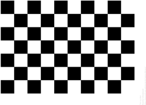
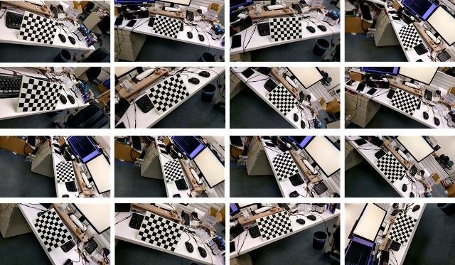
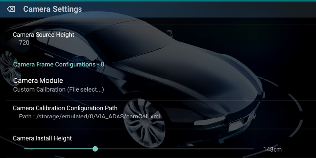

Camera Calibration
=====

VIA-AI部份演算法基於opencv的鏡頭模型, 為了達到完整功能, 請先透過以下流程校正您的手機鏡頭

1. 請下載以下鏡頭校正用棋盤格[Pattern](https://docs.opencv.org/2.4/_downloads/pattern.png), 並使用A4印製出來貼在一個固體平面上以完成校正板 
     
2. 輸入校正板的資訊, 包括校正板尺寸 (Board Width, Board Height) 與 棋盤格的尺寸 (cm), 例如上述提供的校正樣板資訊, 為Board Width 9, Board Height 6.
   所有資訊輸入完成後, 才會開始進行Pattern識別 
     
3. 請移動相機, 讓校正板能以各種角度出現在相機畫面內, 如下圖, 持續本步驟直到左上角進度條為100%, 請勿在同一角度或位置停留超過太久. 
     
    
4. 進度條100％時會開始進行校正程序, 屆時請稍等一段時間直到運算結束, 請不要將校正程序的畫面關閉或者是縮小, 這將會導致校正程序重啟. 
     
5. 校正結束後請點選右下角按鈕, 將校正資訊儲存到手機內, VIA-AI dashcam app執行時將會需要此設定檔

6. 進入Setting界面, 選擇Camera Settings->設定 Camera Module為<b>Custom Calibration</b>  
   點擊Camera Calibration Configuration Path選擇您剛剛儲存校正檔案的路徑. 設定完即完成鏡頭校正 
     