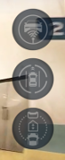
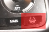
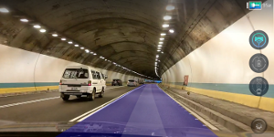

System Calibration
=====

<b>進行此步驟前, 請先確保[鏡頭校正](../CameraCalibration/README.md)已經完成並在Setting內設定Camera Calibration檔案.</b>

VIA-AI提供行車時校正系統的功能, 此功能需要在高速公路或平坦的直線道路上使用, 請依照下列步驟完成系統校正:

1. 完成鏡頭校正後, 下一步必需進行系統校正, 請將手機安裝到支架上, 安裝手機時請盡可能穩固安裝,  避免手機因車輛行駛產生晃動.

2. 請將Panda安裝至Giraffe上, 並透過USB cable連接至手機.

3. 開啟VIA-AI dashcam app, 並點擊中央的<b>START</b>按鈕進入系統, 等待系統初始化後請檢查右手邊的Panda狀態按鈕是否亮起（如下圖）, 若呈現Online請進行後續步驟, 若按鈕呈現offline狀態, 請參考[錯誤排除](#Trouble-Shooting) 
    
    | Panda Online              | Panda Offline             |
    | ------------------------- | ------------------------- |
    |   |    |

4. 初次使用時, 畫面將會出現尚未校正系統的提醒, 此時請將車輛行駛至高速公路上, 並根據下表的方式啟動校正功能 

    | Make                 | Model                    | Supported Package    | How to enable auto calibration                                                                         |
    | ---------------------| -------------------------| ---------------------| ------------------------------------------------------------------------------------------------------ |
    | Honda                | CR-V 2017-19             | Honda Sensing        | Click the LKS button on steering wheel 3 times   |

5. 啟動校正功能後, 請盡可能將車輛保持在車道中間行駛一段時間, 校正程序約在30s ~2分鐘內完成. 

    | System not Calibrated | Calibrating            |  Calibration Finished |
    | --------------------- | ---------------------- | --------------------- |
    |   |  |   |

6. 校正程序完成後, 請根據下表的方式啟動LKS & ACC. 

    | Make                 | Model                    | Supported Package    | How to enable ACC & LKS                                                                                  |
    | ---------------------| -------------------------| ---------------------| -------------------------------------------------------------------------------------------------------- |
    | Honda                | CR-V 2017-19             | Honda Sensing        | Click the RES+ or -SET button on steering wheel    |

7. 啟動後仍請專心於路況, 因自動校正可能會因為路段或者是行駛習慣而有偏差, 若發現LKS系統啟動後容易離車道或蛇行, 請重新進行自動校正動作.

8. VIA-AI的LKS & ACC系統將會在您踩下煞車或油門後自動解除

Trouble Shooting
==========

* Panda無法透過usb連線, 呈現offline狀態, 請嘗試以下組合：
    * 將VIA-AI dashcam app關閉, 將Panda從Giraffe上拔除並重新連接, 重啟dashcam app
    * 將VIA-AI dashcam app關閉, 拔除並重新連接OTG cable, 重啟dashcam app
    * <b>!!注意!! </b> dashcam app啟動並執行偵測系統時, 請勿拔除與Panda間的連線, 否則可能發生訊號異常的潛在危險.

