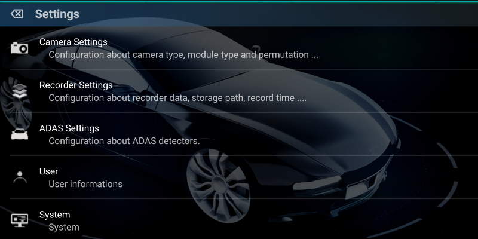
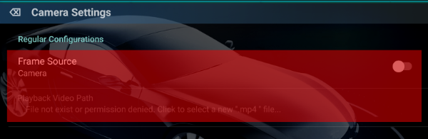
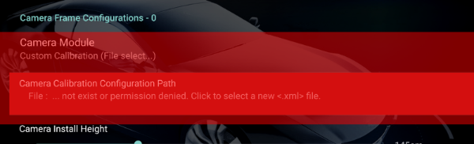
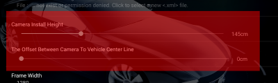
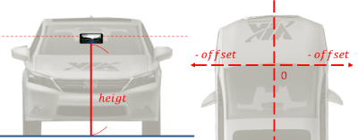

Application Settings
=====

Application Setting include settings about Camera, Recorder, ADAS, User, System. 

The detail of settings please refer to each items, Following items show the special attentions:

* <b>Camera Settings</b>
  1. <b>Frame Source</b> 
    Frame source support camera mode and video playback mode, if choose video playback, you must select video path by "Playback Video Path" item.   
    <b>Note</b> : Video play back mode doesn't support CANBus record playback & sync now, Only the video & sensing data will replayed. 
    

  2. <b>Camera Module</b> 
    Camera Module is used to configure camera data, if your phone model don't listed in the table or you want to use custom camera configurations. Please select "Custom" and use "Camera Calibration Configuration Path" to select camera calibration file. 
    <b>Note:</b>Camera calibration file must generated from VIA-AI Camera Calibration, the configuration generated from 3rd party software is incompatible. 
    
    
  3. <b>Camera Install Height & Offset between vehicle center line </b> 
    Camera Install Height : The vertical height from phone'camera to ground. 
    Offset between vehicle center line : From inside of vehicle to outside, the left is negative, right is positive. 
    Please set these 2 value after phone mount installation, units are cm. 

     |  Parameter                     | Schematic Diagram                |  
     | ------------------------------ | -------------------------------- | 
     |  |  |
     
* <b>Recorder Settings</b>
  1. To enable video record, please config "Video Record Status" as Enable, an configure recording path.
  2. Vehicle Bus data muse enable video record first, or it will be Disabled in default.

* <b>ADAS Settings</b>
  1. <b>Regular Settings</b>  
    The configuration path about Sensing & Automotive, don't modify the path except you want use the custom configuration 
    * Sensing Configuration : Configuration about Sensing & ADAS, such as LDW, FCW
    * Automotive Configuration : Configuration about LKS, ACC, Car controller.

  2. <b>Audio Setting</b> 
    * Text-To-Speech : Enable google TS or not.
    * Beep Alarm : Enable beep or not.

* <b>User</b>
  Reference from : [User Managerment](../UserManagerment/README.md)

* <b>System</b>
  Show the system version

