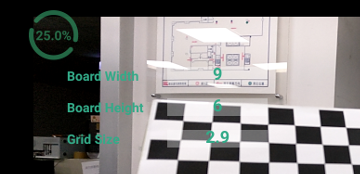
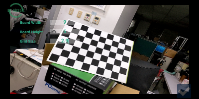
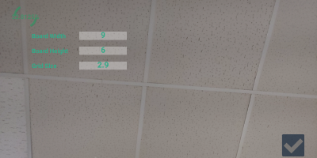

Camera Calibration
=====

* The parameter of calibration board, such board size(width, height) and chess-grid's size (cm). 
  

* Pattern detection status 

  | Detect Pattern (with black boarder)   | No Detected  (no boarder)          |
  | ------------------------------------- | ---------------------------------- |
  |        |  |

* Calibration result 
  Blue textview shows the calibration result of camera (intrinsic matrix, extrinsic matrix)  
  