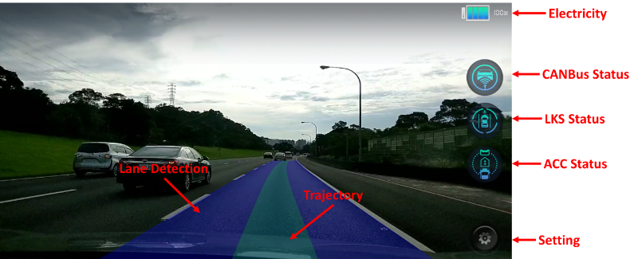

System UI
=====

* CANBus status (Panda Status) : Enabled if Panda dongle connected.

    | Panda Online                       | Panda Offline                         |
    | ---------------------------------- | ------------------------------------- |
    |   |   |

* LKS status : Enabled if driver enable system.
    * LKS will disabled when speed lower/over the vehicle lateral control limitation. [link](../../../../README.md)
    * LKS also disabled when driver take over the steering wheel.
    * When step on the brake/gas pedal, LKS will disable automatically.
    
    | LKS Enable                    | LKS Disable                     |
    | ----------------------------- | ------------------------------- |
    |   |    |

* ACC status : Enabled if driver enable system.
    *  When step on the brake/gas pedal, LKS will disable automatically.
    
    | ACC Enable                    | ACC Disable                     |
    | ----------------------------- | ------------------------------- |
    |   |    |
