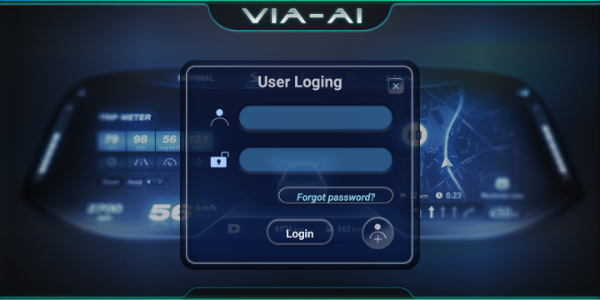
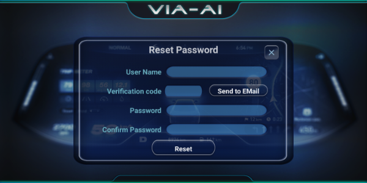
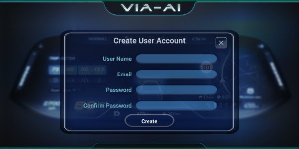
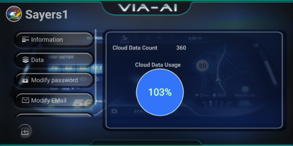
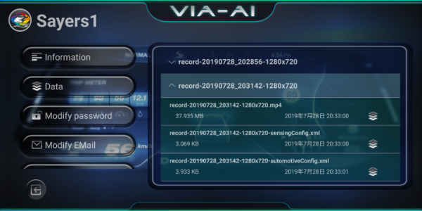
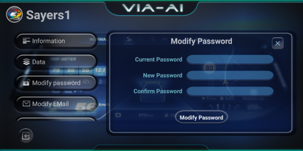
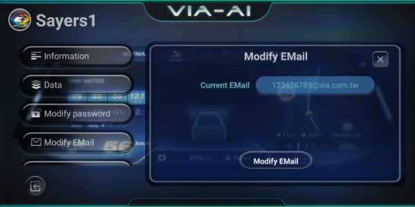

User Management
=====

User management interface is used to manage account operations, such as register, modify password... 
Please register a new VIA-AI account before launch VIA-AI system. This account is compatible for all VIA-AI service in future. 

* <b>User Login Interface</b>
  1. Login by user account & password. 
    

* <b>Reset Password Interface</b>
  1. To reset password, please input the register user account first.
  2. Click <b>"Send to Mail"</b>  button, and the verification code will send to the user email which is configured in account register.  
  3. Input verification code & new password, click reset to finish reset password 
    

* <b>Signup Interface</b>
  1. 此界面提供使用者註冊帳號使用. 我們將會根據此帳號為您提供VIA-AI相關線上服務
  2. email可作為忘記密碼時接收驗證碼使用，故請輸入有效的email 
    

* <b>User Information Interface</b>
  1. 登入後, 此界面作為初始介面, 將顯示使用者各項資訊，包括上傳的檔案數量與線上儲存空間的容量
  2. 點擊左手邊的按鈕可切換至不同功能頁面
  3. 若想切換使用者請點擊功能表列中的Logout.
  4. 若想回到Dashcam APP或Setting介面, 請點擊左下角離開按鈕 
    

* <b>Record Interface</b>
  1. 此界面會列出目前已經上傳至Server的各個紀錄檔, 若紀錄檔內有包含CANBus資訊也會一併列出
  2. 紀錄內容包括上傳檔名,容量與時間, 同一群組的紀錄檔會被合併顯示. 
    

* <b>Change Password Interface</b>
  1. 此界面提供使用者更換密碼, 請先輸入原有的密碼與新密碼來進行更換 
    

* <b>Change Password Interface</b>
  1. 此界面提供使用者更換email, 請先輸入新email來進行更換 , 請輸入有效的email, 以利未來忘記密碼時使用， 
    

