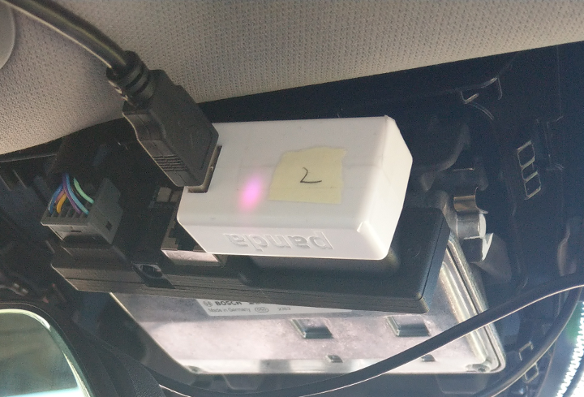

Installing comma.ai Giraffe & Panda
=====

Install comma.ai giraffe need remove the camera cover of vehicle sensing system, be careful to the tenons of camera cover when installing.  
comma.ai giraffe just installing once and no need to be removed frequently, unless vehicle need maintenance. 

<b>Note</b>: Remove stock system and use comma.ai giraffe will trigger some malfunction indicator lamps, the lamps will closed when VIA-AI system launch.  

## Supported Cars 1
Find the supported cars and compatible comma.ai giraffe type by following table : 

| Make                 | Model                    | Supported Package    | Giraffe           |
| ---------------------| -------------------------| ---------------------| ------------------|
| Honda                | CR-V 2017-19             | Honda Sensing        | Honda Bosch       |

** 1. Thanks the contribution of comma.ai & community, the Giraffes are referenced from [openpilot](https://github.com/commaai/neo/tree/master/giraffe)

##  Getting Started
1. Please reference the installation guide from comma.ai. [link](https://community.comma.ai/wiki/index.php/Installing_Giraffe)
2. Installation result (Honda CRV):  
    