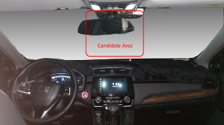
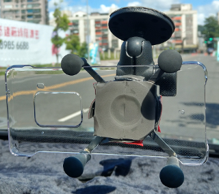

Installing Smartphone Mounts
=====

## Mount Requisites
* Phone mount must install to the windshield stably
* Due to the driving shaking, the twist lock mount is recommended to use (such as RAN mounts, MWUPP mounts ), snake shaped mounts are not recommended. 
* To avoid phone mount fall down when driving, please use the automotive tape to install mount. The suction cup mounts are not recommended.

##  Getting Started
1. Smartphone mount should be mounted to the roughly center of front windshield.   
    

2. Mount smartphone and adjust mount, let camera see the road.
  * You could lauch <b>VIA-AI Camera Calibration</b> application to preview camera.
  * Road must in the 1/2 of camera view at least. such as: 
     

3. (optional) We recommend you sticky the phone case on the mount to avoid position offset when smartphone mounting in future,

4. Installation result (Honda CRV)  
    
  